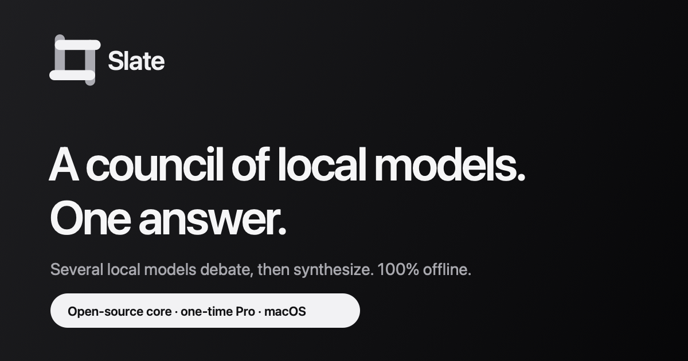
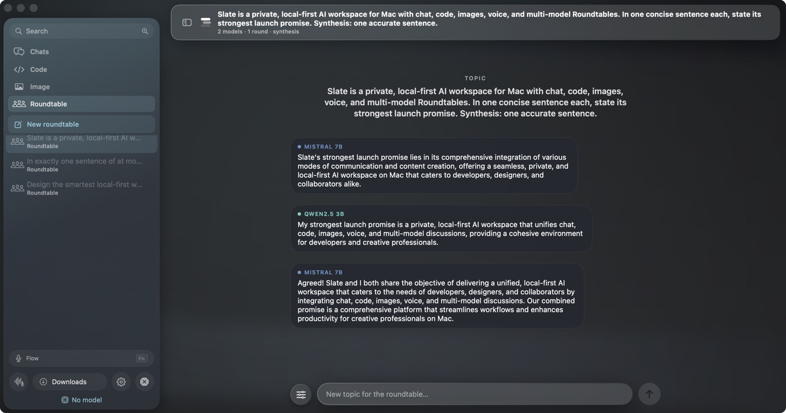
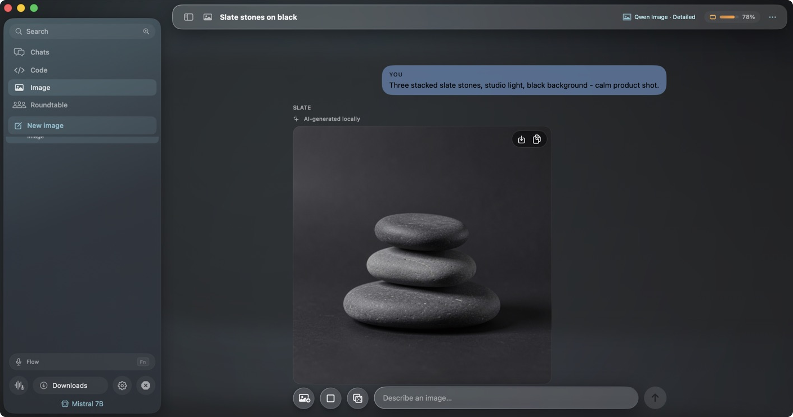
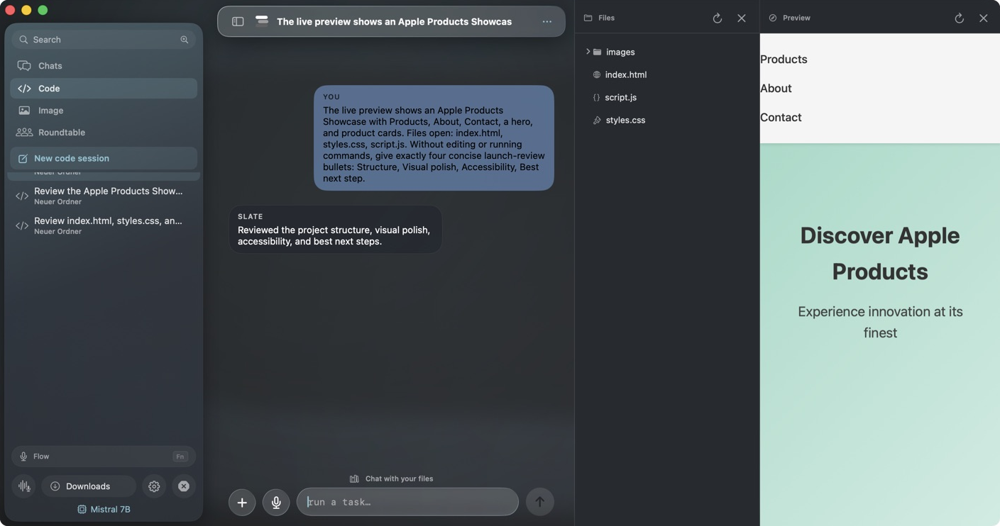
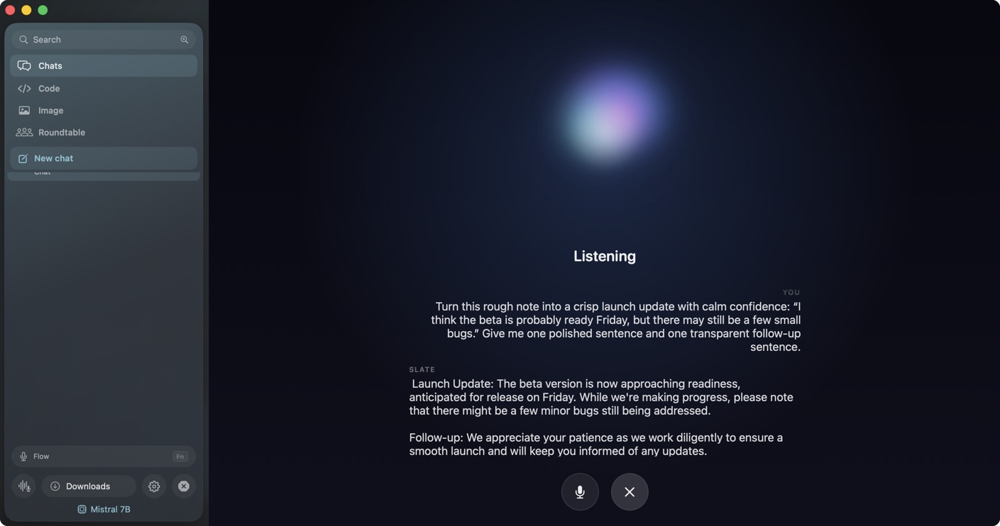
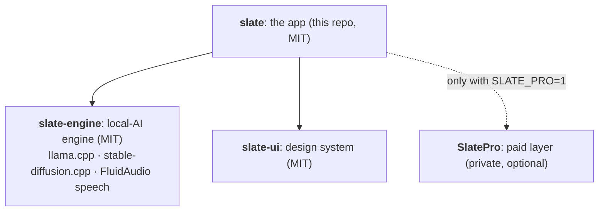

<div align="center">



&nbsp;


**A native macOS workspace for local AI.**
Chat, code, images, voice and system-wide dictation, running on your Mac, offline by default.

[Website](https://slate-app.org) · [Releases](https://github.com/Lange-Co-Consulting/slate/releases) · [slate-engine](https://github.com/Lange-Co-Consulting/slate-engine) · [slate-ui](https://github.com/Lange-Co-Consulting/slate-ui)

</div>

---

Slate turns a Mac into a private AI workstation. Local GGUF chat and coding
agents, on-device image generation, hands-free voice conversations, and a
system-wide dictation hotkey, all offline by default. Cloud models are optional
and stay off until you add a key; API keys live in the macOS Keychain and never
touch a settings export.

Slate bundles **no** chat or image models. Bring your own from Hugging Face via
the in-app Model Manager, or connect any OpenAI-compatible endpoint. Only the
small speech models ship.

## Highlights

| | |
|---|---|
| **Local chat & code** | GGUF models via llama.cpp, with a real coding agent (read/edit/run, sandboxed & permissioned) |
| **Roundtable** | Several local models debate a topic in turns, then synthesize one combined answer |
| **On-device images** | stable-diffusion.cpp text-to-image and img2img, no cloud round-trip |
| **Voice & Flow** | Hands-free voice conversations, plus hold-a-hotkey dictation into *any* Mac app |
| **Yours, private** | Offline-first; a master Silent Mode cuts every network client while local work keeps running |
| **Cloud when you want** | Any OpenAI-compatible API, Claude Code or OpenCode, opt-in and off by default |

## In the app

<div align="center">

| Roundtable | Local image generation |
|:--:|:--:|
|  |  |
| **Agentic coding** | **Voice conversations** |
|  |  |

</div>

## Quick start

Requires an Apple Silicon Mac on **macOS 26+** and **Swift 6** (Xcode with the
macOS 26 SDK).

```sh
git clone https://github.com/Lange-Co-Consulting/slate.git
cd slate
swift run SlateApp
```

That's it. SwiftPM resolves the engine and design system from GitHub and
downloads the engine's binary frameworks (llama / stable-diffusion) as pinned,
checksummed release assets, with no manual provisioning.

```sh
./Scripts/verify.sh          # plist + build + tests
```

## Open core

Slate is **open-core**. This repository, the app itself, is fully open source
(MIT). It builds and runs completely on its own; a small paid layer (**SlatePro**:
licensing + a few premium capabilities) is a separate private package the free
build doesn't need. Pro-only features simply show an upgrade prompt.



- **[slate-engine](https://github.com/Lange-Co-Consulting/slate-engine)**: the local-AI engine and the pure licence-verification model. Binary frameworks ship as checksummed release assets.
- **[slate-ui](https://github.com/Lange-Co-Consulting/slate-ui)**: the shared design system (palette, tokens, Liquid-Glass surfaces, atoms).

## Project layout

- `SlateApp/`: the SwiftUI app and orchestration
- `Tools/SlateCLI`: `slatectl`, the bundled offline CLI (search, transcription, local-model Q&A for Terminal / Shortcuts)
- `Scripts/`, `SlateApp/Packaging/`: verify / version / package scripts

The execution trust model is documented in [SECURITY.md](SECURITY.md); the
release inventory is in [THIRD_PARTY_NOTICES.md](THIRD_PARTY_NOTICES.md).

## Contributing

Contributions are welcome. See [CONTRIBUTING.md](CONTRIBUTING.md). In short:
`swift run SlateApp` to build the free app, keep changes small and green
(`./Scripts/verify.sh`), and open a PR.

## License

MIT. See [LICENSE](LICENSE). Attribution is required for NVIDIA Parakeet-TDT
(CC-BY-4.0), surfaced in Settings → About.

<div align="center">
<sub>Built by <a href="https://slate-app.org">Lange &amp; Co. Consulting</a> · Dark is the identity.</sub>
</div>
